---
## Front matter
title: "Отчет по лабораторной работе №5"
subtitle: "Дисциплина: архитектура компьютера"
author: "Игнатенкова В. Н."

## Generic otions
lang: ru-RU
toc-title: "Содержание"

## Bibliography
bibliography: bib/cite.bib
csl: pandoc/csl/gost-r-7-0-5-2008-numeric.csl

## Pdf output format
toc: true # Table of contents
toc-depth: 2
lof: true # List of figures
lot: true # List of tables
fontsize: 12pt
linestretch: 1.5
papersize: a4
documentclass: scrreprt
## I18n polyglossia
polyglossia-lang:
  name: russian
  options:
	- spelling=modern
	- babelshorthands=true
polyglossia-otherlangs:
  name: english
## I18n babel
babel-lang: russian
babel-otherlangs: english
## Fonts
mainfont: PT Serif
romanfont: PT Serif
sansfont: PT Sans
monofont: PT Mono
mainfontoptions: Ligatures=TeX
romanfontoptions: Ligatures=TeX
sansfontoptions: Ligatures=TeX,Scale=MatchLowercase
monofontoptions: Scale=MatchLowercase,Scale=0.9
## Biblatex
biblatex: true
biblio-style: "gost-numeric"
biblatexoptions:
  - parentracker=true
  - backend=biber
  - hyperref=auto
  - language=auto
  - autolang=other*
  - citestyle=gost-numeric
## Pandoc-crossref LaTeX customization
figureTitle: "Рис."
tableTitle: "Таблица"
listingTitle: "Листинг"
lofTitle: "Список иллюстраций"
lotTitle: "Список таблиц"
lolTitle: "Листинги"
## Misc options
indent: true
header-includes:
  - \usepackage{indentfirst}
  - \usepackage{float} # keep figures where there are in the text
  - \floatplacement{figure}{H} # keep figures where there are in the text
---

# Цель работы

Цель данной лабораторной работы - освоение процедуры компиляции и сборки программ, написанных на ассемблере NASM.

# Выполнение лабораторной работы

Перехожу в директорию arch-pc, создаю каталог lab05, перехожу в него, создаю файл hello.asm, проверяю, что он создался (рис. [-@fig:001]).

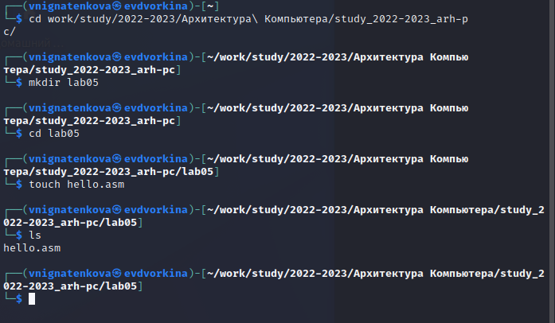{ #fig:001 width=70% }

Открываю файл hello.asm с помощью текстового редактора, вставляю в файл программу (рис. [-@fig:002]).

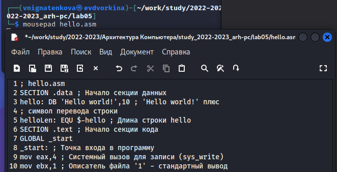{ #fig:002 width=70% }

Компилирую файл программы в объктный файл. Проверяю, что объектный файл был создан (рис. [-@fig:003]).

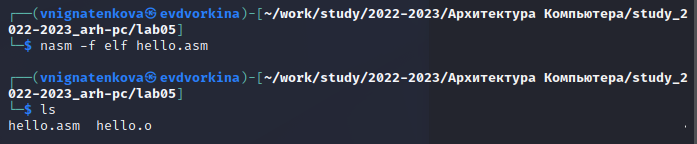{ #fig:003 width=70% }

Выполняю компиляцию файла с помощью расширенного синтаксиса командной строоки (рис. [-@fig:004]).

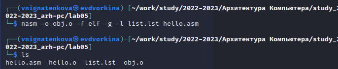{ #fig:004 width=70% }

Передаю файл на обработку компоновщику (рис. [-@fig:005]).

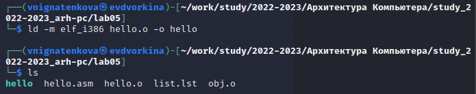{ #fig:005 width=70% }

Выполняю команду (рис. [-@fig:006]). Исполняемый файл будет иметь имя main, объектный файл иммет имя obj.o.

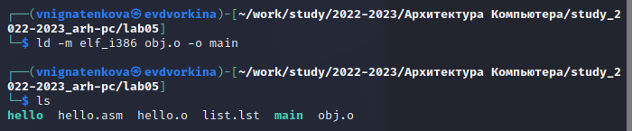{ #fig:006 width=70% }

Запускаю исполняемый файл (рис. [-@fig:007]).

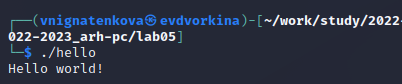{ #fig:007 width=70% }

# Выполнение заданий для самостоятельной работы

Копирую файл hello.asm с именем lab5.asm (рис. [-@fig:008]).

{ #fig:008 width=70% }

Изменяю программу так, чтобы она вывела имя и фамилию (рис. [-@fig:009]).

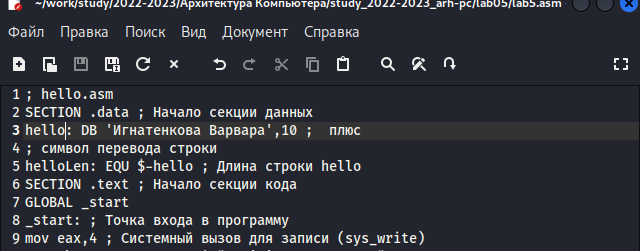{ #fig:009 width=70% }

Транслирую текст программы в объектный файл, выполняю компоновку объектного файла и запускаю получившийся исполняемый файл (рис. [-@fig:010]).

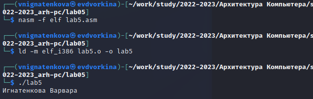{ #fig:010 width=70% }

Копирую файлы hello.asm и lab5.asm в мой локальный репозиторий (рис. [-@fig:010]).

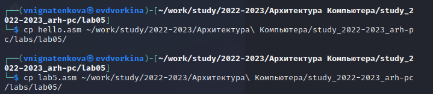{ #fig:011 width=70% }

Загружаю файла на GitHub (рис. [-@fig:011]).

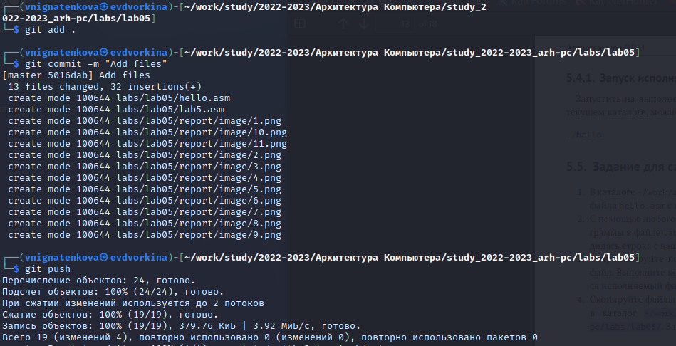{ #fig:012 width=70% }

# Выводы

Я освоила процедуры компиляции и сборки программ, написанных на ассемблере NASM.
