---
## Front matter
title: "Отчет по лабораторной работе №7"
subtitle: "Дисциплина: архитектура компьютера"
author: "Игнатенкова В. Н"

## Generic otions
lang: ru-RU
toc-title: "Содержание"

## Bibliography
bibliography: bib/cite.bib
csl: pandoc/csl/gost-r-7-0-5-2008-numeric.csl

## Pdf output format
toc: true # Table of contents
toc-depth: 2
lof: true # List of figures
lot: true # List of tables
fontsize: 12pt
linestretch: 1.5
papersize: a4
documentclass: scrreprt
## I18n polyglossia
polyglossia-lang:
  name: russian
  options:
	- spelling=modern
	- babelshorthands=true
polyglossia-otherlangs:
  name: english
## I18n babel
babel-lang: russian
babel-otherlangs: english
## Fonts
mainfont: PT Serif
romanfont: PT Serif
sansfont: PT Sans
monofont: PT Mono
mainfontoptions: Ligatures=TeX
romanfontoptions: Ligatures=TeX
sansfontoptions: Ligatures=TeX,Scale=MatchLowercase
monofontoptions: Scale=MatchLowercase,Scale=0.9
## Biblatex
biblatex: true
biblio-style: "gost-numeric"
biblatexoptions:
  - parentracker=true
  - backend=biber
  - hyperref=auto
  - language=auto
  - autolang=other*
  - citestyle=gost-numeric
## Pandoc-crossref LaTeX customization
figureTitle: "Рис."
tableTitle: "Таблица"
listingTitle: "Листинг"
lofTitle: "Список иллюстраций"
lotTitle: "Список таблиц"
lolTitle: "Листинги"
## Misc options
indent: true
header-includes:
  - \usepackage{indentfirst}
  - \usepackage{float} # keep figures where there are in the text
  - \floatplacement{figure}{H} # keep figures where there are in the text
---

# Цель работы

Цель данной лабораторной работы - освоение арифметических инструкций языка ассемблера NASM

# Выполнение лабораторной работы

Создала директорию lab07, переместилась в нее, создала файл lab7-1.asm, проверила, что файл был создан (рис. [-@fig:001])

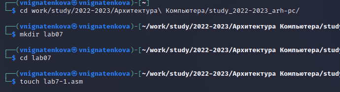{ #fig:001 width=70% }

Записала в файл lab7-1.asm программу (рис. [-@fig:002]).

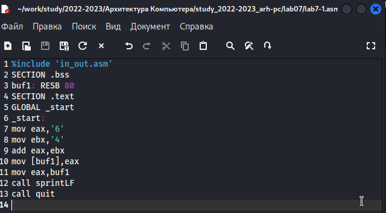{ #fig:002 width=70% }

Копирую в текущий каталог файл in_out.asm (рис. [-@fig:003]).

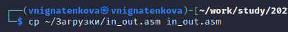{ #fig:003 width=70% }

Создаю исполняемый файл программы и запускаю его (рис. [-@fig:004]). Программа вывела символ j, потому что он соответствует сумме двоичных кодов символов 4 и 6 по системе ASCII.

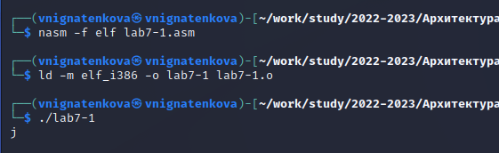{ #fig:004 width=70% }

Изменаю программу (рис. [-@fig:005]).

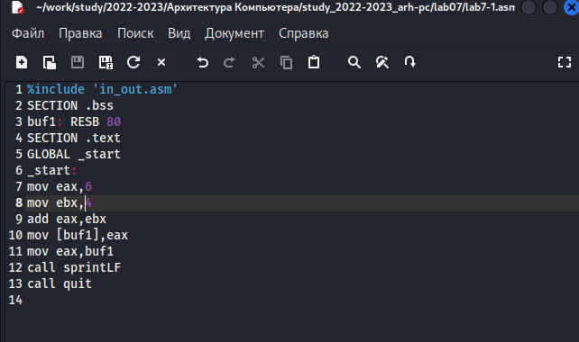{ #fig:005 width=70% }

Создаю исполняемый файл программы и запускаю его (рис. [-@fig:006]). Программа вывела символ перевода строки, потому что он соответствует коду 10=6+4 по системе ASCII.

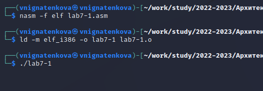{ #fig:006 width=70% }

Создаю файл lab7-2.asm (рис. [-@fig:007]).

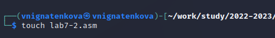{ #fig:007 width=70% }

Ввожу текст программы в созданный файл (рис. [-@fig:008]).

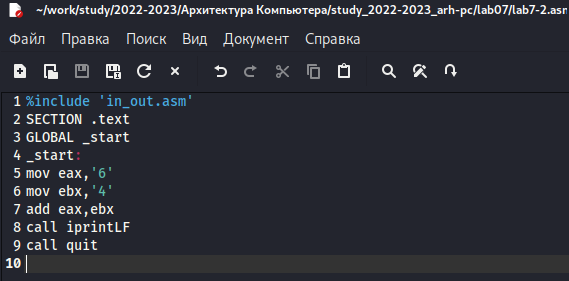{ #fig:008 width=70% }

Создаю и запускаю исполняемый файл lab7-2 (рис. [-@fig:009]). Теперь программа выводит число, а не символ, но это число - сложение кодов символов "6" и "4".

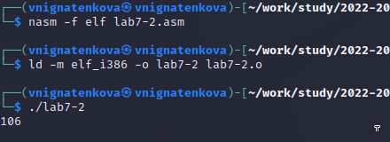{ #fig:009 width=70% }

Изменяю программу (рис. [-@fig:010]).

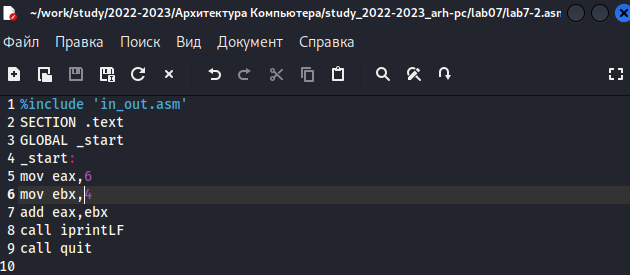{ #fig:010 width=70% }

Запускаю новый исполняемый файл, теперь складываются именно цифры (рис. [-@fig:011]).

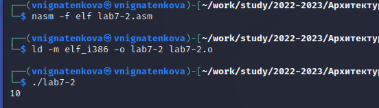{ #fig:011 width=70% }

Заменяю в тексте программы функцию iprintLF на iprint (рис. [-@fig:012]).

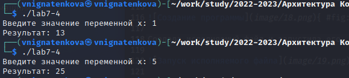{ #fig:012 width=70% }

Создаю и запускаю новый исполняемый файл (рис. [-@fig:013]). Вывод не изменился,
потому что символ переноса строки не отображался, когда программа исполнялась с функцией iprintLF, а iprint не добавляет к выводу символ переноса строки.

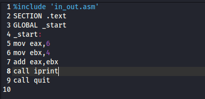{ #fig:013 width=70% }

Создаю файл lab7-3.asm и в нем записываю программу (рис. [-@fig:014]).

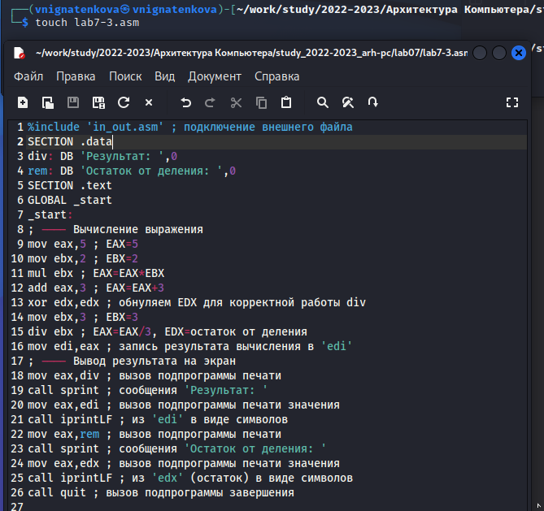{ #fig:014 width=70% }

Создаю исполняемый файл и запускаю его (рис. [-@fig:015]).

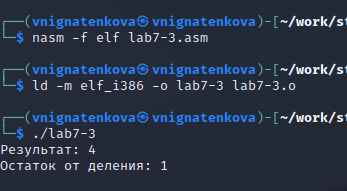{ #fig:015 width=70% }

Изменяю текст программы, чтобы посчитать значение выражения (4*6+2)/5 (рис. [-@fig:016]).

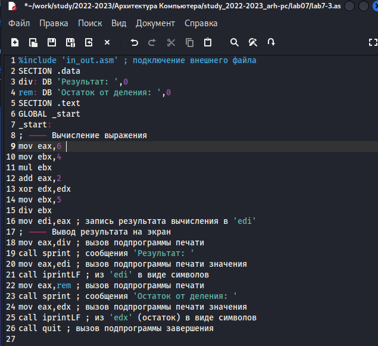{ #fig:016 width=70% }

Создаю исполняемый файл, запускаю его, программа работает корректно (рис. [-@fig:017]).

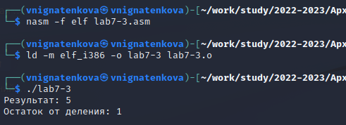{ #fig:017 width=70% }

Создаю файл variant.asm и записываю в него текст программы для вычисления варианта (рис. [-@fig:018]).

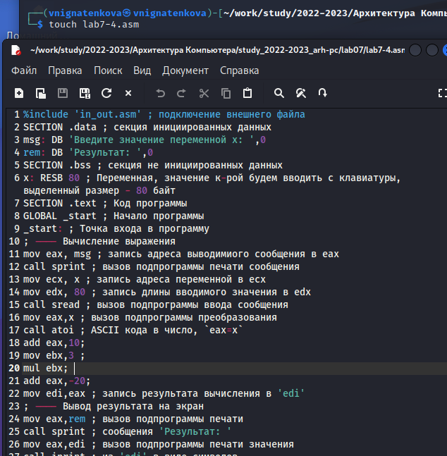{ #fig:018 width=70% }

Создаю исполняемый файл и запускаю его. Мой номер варианта для выполнения заданий для самостоятельной работы - 18 (рис. [-@fig:019]).

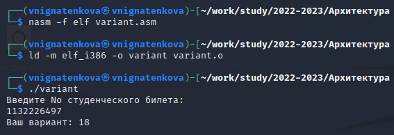{ #fig:019 width=70% }

1. За вывод сообщения “Ваш вариант” отвечают строки кода:
```NASM
mov eax,rem
call sprint
```

2. Инструкция mov ecx, x используется, чтобы положить адрес вводимой стро-
ки x в регистр ecx mov edx, 80 - запись в регистр edx длины вводимой строки
call sread - вызов подпрограммы из внешнего файла, обеспечивающей ввод
сообщения с клавиатуры

3. call atoi используется для вызова подпрограммы из внешнего файла, кото-
рая преобразует ascii-код символа в целое число и записывает результат в
регистр eax

4. За вычисления варианта отвечают строки:
```NASM
xor edx,edx ; обнуление edx для корректной работы div
mov ebx,20 ; ebx = 20
div ebx ; eax = eax/20, edx - остаток от деления
inc edx ; edx = edx + 1
```

5. При выполнении инструкции div ebx остаток от деления записывается в
регистр edx

6. Инструкция inc edx увеличивает значение регистра edx на 1

7. За вывод на экран результатов вычислений отвечают строки:
```NASM
mov eax,edx
call iprintLF
```

# Выполнение заданий для самостоятельной работы

Создала файл lab7-4.asm, в нем написала программу для вычисления выражения из варианта 18: 3*(х+10)-20 (рис. [-@fig:020]).

{ #fig:020 width=70% }

Создала исполняемый файл и запустила его. Программа работает корректно(рис. [-@fig:021]).

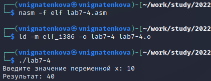{ #fig:021 width=70% }

Проверила работу программы для значений х1 и х2 (рис. [-@fig:022]).

{ #fig:022 width=70% }

**Код написанной программы:**

```NASM
%include 'in_out.asm' ; подключение внешнего файла
SECTION .data ; секция инициированных данных
msg: DB 'Введите значение переменной х: ',0
rem: DB 'Результат: ',0
SECTION .bss ; секция не инициированных данных
x: RESB 80 ; Переменная, значение к-рой будем вводить с клавиатуры, выделенный размер - 80 байт
SECTION .text ; Код программы
GLOBAL _start ; Начало программы
_start: ; Точка входа в программу
; ---- Вычисление выражения
mov eax, msg ; запись адреса выводимиого сообщения в eax
call sprint ; вызов подпрограммы печати сообщения
mov ecx, x ; запись адреса переменной в ecx
mov edx, 80 ; запись длины вводимого значения в edx
call sread ; вызов подпрограммы ввода сообщения
mov eax,x ; вызов подпрограммы преобразования
call atoi ; ASCII кода в число, `eax=x`
add eax,10; 
mov ebx,3 ; 
mul ebx; 
add eax,-20; 
mov edi,eax ; запись результата вычисления в 'edi'
; ---- Вывод результата на экран
mov eax,rem ; вызов подпрограммы печати
call sprint ; сообщения 'Результат: '
mov eax,edi ; вызов подпрограммы печати значения
call iprint ; из 'edi' в виде символов
call quit ; вызов подпрограммы завершения
```
# Выводы

В ходе выполнения лабораторной работы я освоила арифметические инструкции языка ассемблера NASM.

